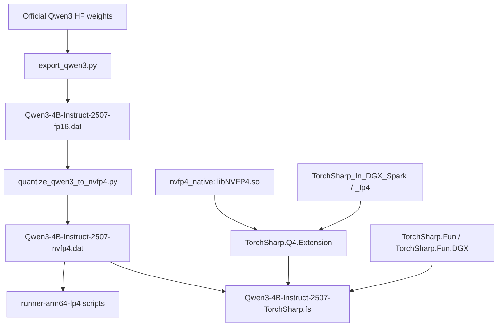

# Qwen3-4B-Instruct-2507-TorchSharp.fs

A pure F# Qwen3 NVFP4 training/inference project.

This repo is built to help F# developers learn and run end-to-end LLM workflows in one codebase: weight loading, forward pass, loss, backward pass, optimizer step, `.dat` export, and inference validation.

Traditional Chinese version: `README.zh-TW.md`.

## Who This Is For
- F# developers entering LLM engineering
- Engineers who want to understand NVFP4 data/compute paths
- Contributors who want both training and inference paths in F#

## Project Highlights
- Pure F# core (`Types/Cli/Nvfp4State/Qwen3Model/InferenceBridge/Trainer/Program`)
- Uses `FAkka.TorchSharp.DGX 26.1.0-py3.9`
- Uses `TorchSharp.Q4.Extension` for NVFP4 quant/dequant + kernel paths
- Qwen3 block wiring (`q/k/v/o + norm + attn + mlp + residual`)
- GQA-aware config (`num_attention_heads`, `num_key_value_heads`)
- Training loss modes:
  - `ce`: token-level cross entropy (main LM path)
  - `scalar`: hidden-state L1 (debug/baseline)
- Chunked + streaming optimizer step support to reduce update-time memory spikes

## Quick Start

### 1) Build
```bash
cd /workspace/Qwen3-4B-Instruct-2507-TorchSharp.fs
dotnet build -c Release
```

### 2) CLI help
```bash
dotnet run -c Release -- --help
```

### 3) Minimal smoke from app entrypoint
```bash
dotnet run -c Release -- \
  --synthetic true \
  --device cuda \
  --epochs 1 \
  --steps-per-epoch 1 \
  --batch-size 1 \
  --in-features 64 \
  --out-features 64
```

## Two Main Workflows

### A) One-step training + VRAM report (environment sanity check)
```bash
cd /workspace/Qwen3-4B-Instruct-2507-TorchSharp.fs
dotnet fsi scripts/Train.OneStep.fsx \
  --device cuda \
  --loss ce \
  --seq-len 8 \
  --step-chunk-rows 16 \
  --train-data TrainData/train-inputs.txt \
  --vram-report doc/train-step-vram-onestep.json
```

### B) Text training + export a new `.dat` (WhoAmI task)
```bash
cd /workspace/Qwen3-4B-Instruct-2507-TorchSharp.fs
dotnet fsi scripts/Train.WhoAmI.AndExportDat.fsx \
  --input-dat /models/qwen3-4b-instruct-2507-torchsharp/Qwen3-4B-Instruct-2507-nvfp4.dat \
  --output-dat artifacts/whoami-trained.dat \
  --train-data TrainData/stageL-1percent-mix.tsv \
  --loss ce \
  --steps 10 \
  --lr 5e-5 \
  --seq-len 96 \
  --step-chunk-rows 32 \
  --compute-dtype float16
```

Notes:
- `--train-last-layers <= 0` means full-parameter mode (default).
- `--train-last-layers N` is debug mode (train only last N layers).
- Export writes a new `.dat` file unless you explicitly reuse an existing path.

## Runner Integration (Recommended)

For validation with `run-training2.fsx` in `fsann/alpha/runner-arm64-fp4`, use the guard wrapper:

```bash
cd /workspace/fsann/alpha/runner-arm64-fp4
dotnet fsi run-script-with-guard.fsx \
  --gpu-limit-gb 108 \
  --gpu-over-secs 0 \
  --gpu-poll-secs 0.5 \
  script run-training2.fsx \
  --weight /workspace/Qwen3-4B-Instruct-2507-TorchSharp.fs/artifacts/whoami-trained.dat \
  --prompt 你是誰 \
  --max-tokens 24 \
  --check-logits false \
  --timing true \
  --stop-here true \
  --KVCacheOut true
```

See `artifacts/BASELINE_BRIDGE_SUCCESS.md` for a fixed baseline command/dat.

For FP2 training-path inference (`run-training-fp2.fsx`) usage and differences vs `run-training2.fsx`, see:
- `runner-arm64-fp4/README.md`

## Related Projects and Lineage

If you want to study this stack from top-level F# scripts down to native CUDA symbols, start from these repositories:

| Project | Link | Role in this project | Lineage / relationship |
|---|---|---|---|
| TorchSharp.Fun | https://github.com/ingted/TorchSharp.Fun | Functional composition helpers used by the training/inference workflow style | Base functional model-composition layer. In this workspace it is consumed via the DGX-focused variant (`/workspace/TorchSharp.Fun.DGX`). |
| nvfp4_native | https://github.com/ingted/nvfp4_native | Native CUDA bridge exposing NVFP4 ops (`scaled_mm`, quantize/dequantize, cache ops) | Lowest-level native backend used by the FP4 path. This project links to `libNVFP4.so` in runtime environments. |
| TorchSharp_In_DGX_Spark | https://github.com/ingted/TorchSharp_In_DGX_Spark | ARM64 DGX-oriented TorchSharp distribution and native wrapper build path | Infrastructure/base for DGX TorchSharp runtime. In this workspace, FP4 work continues in `/workspace/TorchSharp_In_DGX_Spark_fp4` (with `TorchSharp.Q4.Extension`). |

Suggested reading order:
1. `TorchSharp_In_DGX_Spark` (runtime/native foundation)
2. `nvfp4_native` (NVFP4 native ops and exported symbols)
3. `TorchSharp.Fun` (F# functional composition style)
4. This repository (`Qwen3-4B-Instruct-2507-TorchSharp.fs`) for end-to-end training/inference integration

### Building TorchSharp Base on DGX Spark

If you are an F# developer evaluating DGX Spark and worried about TorchSharp support: this stack is already proven in this workspace.

Build from source (base runtime):

```bash
cd /workspace/TorchSharp_In_DGX_Spark
bash build_TorchSharp.Native.sh
bash build_TorchSharp.net.sh
```

Build FP4 branch used by this project:

```bash
cd /workspace/TorchSharp_In_DGX_Spark_fp4
bash build_TorchSharp.Native.sh
bash build_TorchSharp.net.sh
dotnet build TorchSharp.Q4.Extension/TorchSharp.Q4.Extension.fsproj -c Release
```

Then rebuild this repository:

```bash
cd /workspace/Qwen3-4B-Instruct-2507-TorchSharp.fs
dotnet build -c Release
```

This project (`Qwen3-4B-Instruct-2507-TorchSharp.fs`) depends on that DGX Spark TorchSharp foundation.

### Topology Diagram (Mermaid)



## How `Qwen3-4B-Instruct-2507-nvfp4.dat` Is Produced (Important)

This is the canonical path used in this workspace.

### Step 0: script locations
- Companion scripts are in:
  - `/workspace/fsann/Qwen3-4B-Instruct-2507-TorchSharp-mod/Qwen3/export_qwen3.py`
  - `/workspace/fsann/Qwen3-4B-Instruct-2507-TorchSharp-mod/Qwen3/quantize_qwen3_to_nvfp4.py`
  - `/workspace/fsann/Qwen3-4B-Instruct-2507-TorchSharp-mod/Qwen3/dat_reader.py`

### Step 1: official model -> FP16 `.dat`
If you already have `Qwen3-4B-Instruct-2507-fp16.dat`, skip this step.

```bash
cd /workspace/fsann/Qwen3-4B-Instruct-2507-TorchSharp-mod/Qwen3
python export_qwen3.py \
  --model /path/to/official_qwen3_hf_model \
  --dtype float16 \
  --quant none \
  --out /models/qwen3-4b-instruct-2507-torchsharp/Qwen3-4B-Instruct-2507-fp16.dat
```

### Step 2: FP16 `.dat` -> NVFP4 `.dat`
```bash
cd /workspace/fsann/Qwen3-4B-Instruct-2507-TorchSharp-mod/Qwen3
python quantize_qwen3_to_nvfp4.py
```

By default that script uses:
- input: `/models/qwen3-4b-instruct-2507-torchsharp/Qwen3-4B-Instruct-2507-fp16.dat`
- output: `/models/qwen3-4b-instruct-2507-torchsharp/Qwen3-4B-Instruct-2507-nvfp4.dat`

Important behavior in quantization script:
- It quantizes selected 2D projection weights only:
  - `q_proj`, `k_proj`, `v_proj`, `o_proj`, `gate_proj`, `up_proj`, `down_proj`, `lm_head`
- It keeps `embed_tokens` and `norm` in non-NVFP4 raw tensors.
- Quantized tensors are stored as paired keys:
  - `*.qdata`
  - `*.scale`

### Step 3: verify output `.dat`
Quick runtime verification:

```bash
cd /workspace/Qwen3-4B-Instruct-2507-TorchSharp.fs/runner-arm64-fp4
dotnet fsi run-script-with-guard.fsx \
  --gpu-limit-gb 108 --gpu-over-secs 0 --gpu-poll-secs 0.5 \
  script run-training2.fsx \
  --weight /models/qwen3-4b-instruct-2507-torchsharp/Qwen3-4B-Instruct-2507-nvfp4.dat \
  --prompt 你是誰 --max-tokens 24 --check-logits false --timing true --stop-here true --KVCacheOut true
```

Optional structure check (Python):
- Use `dat_reader.py` to inspect whether projection families have `qdata/scale` pairs and required raw tensors still exist.

## Repository Map

### Core code
- `Types.fs`: training config, defaults, Q4 session/schema defaults
- `Cli.fs`: command-line parsing
- `Nvfp4State.fs`: streaming `.dat` loader (`qdata`/`scale` pairs)
- `Qwen3Model.fs`: model construction, trainable params, forward/KV forward
- `Qwen3Core.fs`: block graph (attention, RoPE, MLP, residual)
- `InferenceBridge.fs`: inference wiring + tokenizer flow
- `Nvfp4Optimizer.fs`: packed optimizer + chunked step implementation
- `Trainer.fs`: train loop, loss, checkpoint, VRAM profiling
- `Program.fs`: app entrypoint

### Data and scripts
- `TrainData/`: training datasets (`prompt<TAB>target` TSV)
- `scripts/Train.OneStep.fsx`: one-step training + VRAM JSON output
- `scripts/Train.WhoAmI.AndExportDat.fsx`: training + `.dat` export + quick self-test
- `scripts/Generate.WhoAmINaturalData.fsx`: natural-style dataset generation
- `scripts/Tests.Parity.fsx`: runner readability/stability spot-check
- `scripts/Tests.KVCStress.fsx`: KV-cache stress matrix
- `runner-arm64-fp4/`: cleaned local copy of runner scripts with postmortem and dtype/VRAM notes (`runner-arm64-fp4/README.md`)
- `models/qwen3-4b-instruct-2507-torchsharp/`: local copy of non-`.dat` model metadata (`config.json`, `tokenizer*.json`) for reproducible script dependencies

### Design and experiment docs
- `doc/Architecture.md`: architecture overview
- `doc/NVFP4_DataPath.md`: NVFP4 storage/compute path details
- `doc/SA.md`: system analysis (risks/strategy)
- `doc/SD.md`: system design
- `doc/WBS.md`: work breakdown and tracking
- `doc/DevLog.md`: experiment log (including failures and fixes)
- `notes/`: raw notes and investigation references
- `artifacts/檔案說明清單.md`: artifact usage inventory

## LLM Terms (Project Context)
- `step`: one parameter update (forward + loss + backward + optimizer step)
- `seq-len`: max token length used per training sample window
- `KV cache`: inference acceleration cache; usually off in training path
- `CE loss`: cross entropy between logits and target token IDs
- `step-chunk-rows`: rows processed per optimizer chunk; smaller is usually safer but slower

## Practical Notes
- Offload is disabled by default for DGX Spark profile in this project.
- Large `.dat` files are ignored by git (`artifacts/**/*.dat`).
- For stability, run `Train.OneStep.fsx` before long runs.
- Validate quality with fixed A/B prompts (e.g., `你是誰` and unrelated prompts like `談談 UFO`).

## Known Limitations
- This is an engineering-focused, rapidly evolving trainer, not a full production trainer.
- Full-parameter long-context training still faces high peak memory pressure; tune with guard.
- Different inference paths (`fp2-model` / bridge / runner) can diverge; run parity checks regularly.

## FAQ

### Q1) On DGX Spark (unified memory), should I enable offload?
Short answer: usually no for this repo's default profile.  
This project keeps offload disabled by default for DGX Spark-oriented runs to avoid extra copy/management overhead.

### Q2) Why do we still use a GPU memory guard (e.g., 108 GB)?
Unified memory does not remove peak-allocation risk.  
Transient buffers, allocator fragmentation, and step-time spikes can still kill the run. Guard is a safety rail.

### Q3) What does `seq-len` control?
Training window length (tokens), not generated output length.  
Larger `seq-len` can improve learning context but raises activation memory pressure.

### Q4) What does `step-chunk-rows` control?
How many parameter rows are updated per optimizer chunk.  
Smaller values reduce step-time memory peaks but are slower.

### Q5) Is `--train-last-layers` full-parameter training?
No.  
`--train-last-layers <= 0` means full-parameter mode (default).  
`--train-last-layers N` is debug mode for last-N-layer tuning.

### Q6) Why does a trained `.dat` look good in one path but not another?
Inference routes can differ (`bridge`, `fp2-model`, runner scripts/options).  
Always validate with fixed prompts and parity scripts (`scripts/Tests.Parity.fsx`) before concluding model quality.

### Q7) Why does the model sometimes over-repeat target phrases?
This is usually dataset/objective imbalance (over-targeted data, too few contrastive samples, or aggressive LR/steps).  
Use mixed data, keep unrelated prompts in validation, and tune `steps/lr/seq-len` conservatively.

### Q8) Did training overwrite my original model file?
Not unless you set `--output-dat` to the original path.  
The training export script writes a new `.dat` by default.

## Troubleshooting Matrix

| Symptom | Likely Cause | Recommended Action |
|---|---|---|
| Process crashes / host becomes unstable during training | Peak memory spike in backward or optimizer step | Use guard runner, lower `seq-len`, lower `--step-chunk-rows` (for example `32 -> 16`), reduce `steps` for sanity first |
| Guard kills process quickly at high memory | Step-time temporary tensor burst | Keep `--gpu-poll-secs` small, reduce chunk rows, run one-step script first to profile phases |
| Output collapses to repeated phrase (for example repeated target tokens) | Over-targeted dataset or too aggressive LR/steps | Use mixed dataset, reduce LR, reduce steps, keep unrelated prompts in validation A/B |
| `你是誰` works but unrelated prompts are degraded | Catastrophic forgetting from narrow objective | Add balanced/mixed training data and run short staged training instead of single overfit stage |
| Same `.dat` behaves differently between paths | Different inference path/options (`bridge`, fp2 model, runner flags) | Lock prompt + flags and run parity checks (`scripts/Tests.Parity.fsx`) before judging quality |
| CE training fails with shape/target mismatch | Input/target window alignment issue | Verify tokenized lengths, ensure next-token target shift, validate response span slicing |
| Training seems to run but model does not improve | Wrong trainable subset or too weak update | Confirm full-parameter mode (`--train-last-layers <= 0`), check loss trend, verify export target path |
| Exported `.dat` loads but quality is corrupted | Incorrect export replacement scope or broken source checkpoint | Re-test with known baseline `.dat`, compare against `artifacts/BASELINE_BRIDGE_SUCCESS.md`, keep backup before export |
| VRAM unexpectedly high at model load | Multiple materialized tensors / duplicated parameter residency | Run one-step VRAM report, inspect dtype/path choices, keep compute dtype conservative (`float16` on CUDA) |
| Interactive runner exits early | `--stop-here` or script flow exits before loop | Ensure `--stop-here false` and verify script supports interactive mode in current branch |

## Recommended Learning Path (F# First)
1. Build and inspect `--help` to understand the full config surface.
2. Run `scripts/Train.OneStep.fsx` to understand one train step and VRAM profiling.
3. Read `Trainer.fs` (`tokenCrossEntropyLoss`, training loop).
4. Run `scripts/Train.WhoAmI.AndExportDat.fsx` end-to-end (train -> export -> self-test).
5. Validate exported `.dat` with runner.
6. Deep dive into `doc/NVFP4_DataPath.md`, `doc/SA.md`, `doc/SD.md`.

## License
`LICENSE`
