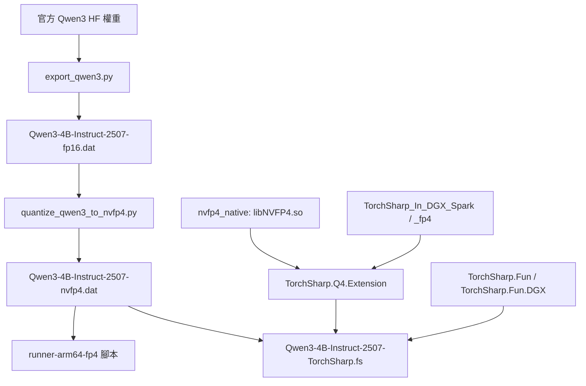

# Qwen3-4B-Instruct-2507-TorchSharp.fs

以純 F# 實作的 Qwen3 NVFP4 訓練/推論專案。  
目標是讓 F# 社群可以直接用熟悉的語言，摸到 LLM 的核心流程: 權重載入、前向、loss、反向、optimizer、匯出 `.dat`、再回推論驗證。

## 這個專案適合誰
- 想用 F# 進入 LLM（不是只調 Python 腳本）
- 想理解 NVFP4 在真實工程中的資料路徑與限制
- 想把「訓練路徑」和「推論路徑」都掌握在同一個 F# codebase

## 專案重點
- 純 F# 主體 (`Types/Cli/Nvfp4State/Qwen3Model/InferenceBridge/Trainer/Program`)
- 使用 `FAkka.TorchSharp.DGX 26.1.0-py3.9`
- 使用 `TorchSharp.Q4.Extension` 執行 NVFP4 quant/dequant + kernel
- 支援 Qwen3 block 結構（q/k/v/o + norm + attn + mlp + residual）
- 支援 GQA 參數 (`num_attention_heads` + `num_key_value_heads`)
- 訓練可選 loss:
  - `ce`: token-level cross entropy（語言建模主路徑）
  - `scalar`: hidden-state L1（除錯/基線用途）
- 支援 chunked + streaming optimizer step（降低 step 峰值記憶體）

## 快速開始

### 1) 建置
```bash
cd /workspace/Qwen3-4B-Instruct-2507-TorchSharp.fs
dotnet build -c Release
```

### 2) 看 CLI 幫助
```bash
dotnet run -c Release -- --help
```

### 3) 最小 smoke（程式主入口）
```bash
dotnet run -c Release -- \
  --synthetic true \
  --device cuda \
  --epochs 1 \
  --steps-per-epoch 1 \
  --batch-size 1 \
  --in-features 64 \
  --out-features 64
```

## 你最常用的兩條路徑

### A. 一步訓練與 VRAM 報表（先確認環境可跑）
```bash
cd /workspace/Qwen3-4B-Instruct-2507-TorchSharp.fs
dotnet fsi scripts/Train.OneStep.fsx \
  --device cuda \
  --loss ce \
  --seq-len 8 \
  --step-chunk-rows 16 \
  --train-data TrainData/train-inputs.txt \
  --vram-report doc/train-step-vram-onestep.json
```

### B. 文本訓練並匯出新 `.dat`（WhoAmI 任務）
```bash
cd /workspace/Qwen3-4B-Instruct-2507-TorchSharp.fs
dotnet fsi scripts/Train.WhoAmI.AndExportDat.fsx \
  --input-dat /models/qwen3-4b-instruct-2507-torchsharp/Qwen3-4B-Instruct-2507-nvfp4.dat \
  --output-dat artifacts/whoami-trained.dat \
  --train-data TrainData/stageL-1percent-mix.tsv \
  --loss ce \
  --steps 10 \
  --lr 5e-5 \
  --seq-len 96 \
  --step-chunk-rows 32 \
  --compute-dtype float16
```

說明:
- `--train-last-layers <= 0` 代表全參數模式（預設）
- `--train-last-layers N` 代表 debug 模式，只訓練最後 N 層
- 匯出的 `.dat` 是新檔，不會覆蓋原始模型檔（除非你指定同一路徑）

## 與 runner 的整合驗證（建議）

若你在 `fsann/alpha/runner-arm64-fp4` 使用 `run-training2.fsx` 做推論驗證，建議走 guard:

```bash
cd /workspace/fsann/alpha/runner-arm64-fp4
dotnet fsi run-script-with-guard.fsx \
  --gpu-limit-gb 108 \
  --gpu-over-secs 0 \
  --gpu-poll-secs 0.5 \
  script run-training2.fsx \
  --weight /workspace/Qwen3-4B-Instruct-2507-TorchSharp.fs/artifacts/whoami-trained.dat \
  --prompt 你是誰 \
  --max-tokens 24 \
  --check-logits false \
  --timing true \
  --stop-here true \
  --KVCacheOut true
```

> `artifacts/BASELINE_BRIDGE_SUCCESS.md` 記錄了可對照的 bridge 成功基準。

若要跑 FP2 訓練路徑推論（`run-training-fp2.fsx`）與了解它和 `run-training2.fsx` 的差異，請看：
- `runner-arm64-fp4/README.md`

## 相關專案與源流

若你想從高階 F# 腳本一路追到低階 CUDA 符號，建議先看以下三個 repo：

| 專案 | 連結 | 在本專案中的角色 | 源流 / 關係 |
|---|---|---|---|
| TorchSharp.Fun | https://github.com/ingted/TorchSharp.Fun | 提供函數式組合風格，影響訓練/推論腳本的組裝方式 | 屬於上層 F# 組合抽象基礎。本工作區實際使用的是 DGX 變體：`/workspace/TorchSharp.Fun.DGX`。 |
| nvfp4_native | https://github.com/ingted/nvfp4_native | 提供 NVFP4 原生 CUDA bridge（`scaled_mm`、quantize/dequantize、cache） | 最底層 native backend。執行時會連到 `libNVFP4.so`。 |
| TorchSharp_In_DGX_Spark | https://github.com/ingted/TorchSharp_In_DGX_Spark | 提供 DGX ARM64 TorchSharp 環境與 native wrapper 編譯路徑 | DGX TorchSharp 基礎建設來源。本工作區 FP4 延伸在 `/workspace/TorchSharp_In_DGX_Spark_fp4`（含 `TorchSharp.Q4.Extension`）。 |

建議閱讀順序：
1. `TorchSharp_In_DGX_Spark`（runtime/native 基礎）
2. `nvfp4_native`（NVFP4 原生運算）
3. `TorchSharp.Fun`（F# 函數式組合）
4. 本專案 `Qwen3-4B-Instruct-2507-TorchSharp.fs`（端到端訓練/推論整合）

### 依賴拓樸圖（Mermaid）



## `Qwen3-4B-Instruct-2507-nvfp4.dat` 產生流程（重要）

這是目前工作區的標準生成路徑。

### Step 0: 腳本位置
- 轉檔腳本在：
  - `/workspace/fsann/Qwen3-4B-Instruct-2507-TorchSharp-mod/Qwen3/export_qwen3.py`
  - `/workspace/fsann/Qwen3-4B-Instruct-2507-TorchSharp-mod/Qwen3/quantize_qwen3_to_nvfp4.py`
  - `/workspace/fsann/Qwen3-4B-Instruct-2507-TorchSharp-mod/Qwen3/dat_reader.py`

### Step 1: 官方模型 -> FP16 `.dat`
如果你已經有 `Qwen3-4B-Instruct-2507-fp16.dat`，可跳過此步。

```bash
cd /workspace/fsann/Qwen3-4B-Instruct-2507-TorchSharp-mod/Qwen3
python export_qwen3.py \
  --model /path/to/official_qwen3_hf_model \
  --dtype float16 \
  --quant none \
  --out /models/qwen3-4b-instruct-2507-torchsharp/Qwen3-4B-Instruct-2507-fp16.dat
```

### Step 2: FP16 `.dat` -> NVFP4 `.dat`
```bash
cd /workspace/fsann/Qwen3-4B-Instruct-2507-TorchSharp-mod/Qwen3
python quantize_qwen3_to_nvfp4.py
```

此腳本預設：
- input: `/models/qwen3-4b-instruct-2507-torchsharp/Qwen3-4B-Instruct-2507-fp16.dat`
- output: `/models/qwen3-4b-instruct-2507-torchsharp/Qwen3-4B-Instruct-2507-nvfp4.dat`

量化腳本的重要行為：
- 只量化特定 2D projection 權重：
  - `q_proj`, `k_proj`, `v_proj`, `o_proj`, `gate_proj`, `up_proj`, `down_proj`, `lm_head`
- `embed_tokens` 與 `norm` 保留為非 NVFP4 raw tensor。
- 量化後以成對 key 存入：
  - `*.qdata`
  - `*.scale`

### Step 3: 驗證輸出 `.dat`
可先用 runner 快速驗證：

```bash
cd /workspace/Qwen3-4B-Instruct-2507-TorchSharp.fs/runner-arm64-fp4
dotnet fsi run-script-with-guard.fsx \
  --gpu-limit-gb 108 --gpu-over-secs 0 --gpu-poll-secs 0.5 \
  script run-training2.fsx \
  --weight /models/qwen3-4b-instruct-2507-torchsharp/Qwen3-4B-Instruct-2507-nvfp4.dat \
  --prompt 你是誰 --max-tokens 24 --check-logits false --timing true --stop-here true --KVCacheOut true
```

可選的結構檢查（Python）：
- 用 `dat_reader.py` 檢查 projection family 是否都出現 `qdata/scale` 成對 key，且必要 raw tensor 仍存在。

## 專案地圖（給 F# + LLM 新手）

### 核心程式
- `Types.fs`: 訓練配置、預設值、Q4 session/schema 預設
- `Cli.fs`: `--args` 解析
- `Nvfp4State.fs`: `.dat` streaming 載入（qdata/scale 對）
- `Qwen3Model.fs`: 模型組裝、參數集合、forward/forwardWithKvCache
- `Qwen3Core.fs`: block graph（注意力、RoPE、MLP、殘差）
- `InferenceBridge.fs`: 推論接線與 tokenizer 流程
- `Nvfp4Optimizer.fs`: packed optimizer、chunked step
- `Trainer.fs`: 訓練 loop、loss、checkpoint、VRAM profile
- `Program.fs`: 入口點

### 資料與腳本
- `TrainData/`: 訓練語料（TSV: `prompt<TAB>target`）
- `scripts/Train.OneStep.fsx`: 1-step 訓練 + VRAM JSON
- `scripts/Train.WhoAmI.AndExportDat.fsx`: 文本訓練 + dat 匯出 + quick self-test
- `scripts/Generate.WhoAmINaturalData.fsx`: 產生自然語感資料
- `scripts/Tests.Parity.fsx`: 與 runner 的可讀性/穩定性 spot-check
- `scripts/Tests.KVCStress.fsx`: KVC 壓力矩陣
- `runner-arm64-fp4/`: 清理版 runner 腳本副本，含 F# God 任務失敗脈絡與 dtype/VRAM 說明（`runner-arm64-fp4/README.md`）
- `models/qwen3-4b-instruct-2507-torchsharp/`: 本地非 `.dat` 模型中繼資料副本（`config.json`、`tokenizer*.json`），用於腳本依賴可重現

### 設計與實驗文件
- `doc/Architecture.md`: 架構總覽
- `doc/NVFP4_DataPath.md`: NVFP4 資料/計算路徑
- `doc/SA.md`: 系統分析（風險與策略）
- `doc/SD.md`: 系統設計
- `doc/WBS.md`: 工作拆解與進度
- `doc/DevLog.md`: 實驗紀錄（含失敗與修正）
- `notes/`: 原始實驗筆記與外部討論素材
- `artifacts/檔案說明清單.md`: 權重檔用途說明

## 新手先懂的 LLM 名詞（對應本專案）
- `step`: 一次參數更新（forward + loss + backward + optimizer step）
- `seq-len`: 每次訓練取用的 token 長度上限
- `KV Cache`: 推論加速快取；訓練主路徑通常關閉
- `CE loss`: 用 logits 對 target token ids 的 cross entropy
- `step-chunk-rows`: optimizer 分塊更新 row 數，越小越省峰值記憶體（通常也較慢）

## 實務注意事項
- 本專案在 DGX Spark 場景預設 `offload` 關閉，避免無效搬運開銷。
- 大型 `.dat` 已在 `.gitignore` 忽略（`artifacts/**/*.dat`）。
- 若你重視穩定性，先跑 `Train.OneStep.fsx` 再跑長訓練。
- 推論品質驗證請固定 prompt 做 A/B（例如 `你是誰` + 非 whoami 題目如 `談談 UFO`）。

## 已知限制
- 這是工程導向專案，不是完整商用 trainer（仍在快速迭代）。
- 長文本全參數訓練的峰值記憶體壓力仍高，需依硬體與 guard 條件調參。
- 不同推論路徑（fp2 model / bridge / runner）可能有行為差異，請用 parity 腳本定期檢查。

## FAQ

### Q1) DGX Spark（統一記憶體）還要開 offload 嗎？
短答: 通常不用。  
本專案在 DGX Spark 取向的預設就是 offload 關閉，避免額外搬運/管理開銷。

### Q2) 為什麼還需要 guard（例如 108GB）？
統一記憶體不代表不會爆峰值。  
暫時 buffer、allocator 碎片化、optimizer step 尖峰仍可能把行程打掛，guard 是保護欄。

### Q3) `seq-len` 在控制什麼？
它控制的是訓練視窗 token 長度，不是生成長度。  
`seq-len` 越大，學習上下文越長，但 activation 記憶體壓力也越高。

### Q4) `step-chunk-rows` 在控制什麼？
它控制 optimizer 每次分塊更新幾列參數。  
數值越小越能壓低 step 峰值記憶體，但速度通常較慢。

### Q5) `--train-last-layers` 算全參數訓練嗎？
不算。  
`--train-last-layers <= 0` 才是全參數（預設）。  
`--train-last-layers N` 是 debug 路徑，只訓練最後 N 層。

### Q6) 為什麼同一個 `.dat` 在某條推論路徑好，另一條不好？
不同推論路徑（`bridge`、`fp2-model`、runner 參數）可能行為不同。  
請固定 prompt，並用 `scripts/Tests.Parity.fsx` 做一致性檢查，再判斷模型品質。

### Q7) 為什麼模型有時會狂重複目標句（例如一直「之神」）？
通常是資料/目標失衡（資料過度集中、對照樣本不足、LR/steps 太激進）。  
建議混合資料訓練，並保留非目標 prompt 做驗證，同時保守調 `steps/lr/seq-len`。

### Q8) 訓練會覆蓋原始模型檔嗎？
除非你把 `--output-dat` 指到原始檔路徑，否則不會。  
訓練腳本預設是輸出新 `.dat`。

## 疑難排查矩陣

| 症狀 | 常見原因 | 建議處理 |
|---|---|---|
| 訓練時行程掛掉 / 主機不穩 | backward 或 optimizer step 峰值記憶體過高 | 一律用 guard，先降 `seq-len`，再降 `--step-chunk-rows`（例如 `32 -> 16`），先做短步數驗證 |
| guard 很快就砍行程 | step 階段暫時 tensor 暴衝 | 維持較小 `--gpu-poll-secs`，縮小 chunk rows，先跑 one-step 腳本看各 phase |
| 輸出崩成重複句（例如一直重複目標詞） | 資料過度集中或 LR/steps 太激進 | 換 mixed 資料、降低 LR、減少 steps，驗證時保留非目標 prompt 做 A/B |
| `你是誰` 正常，但其他題目變差 | 窄目標造成災難性遺忘 | 增加平衡語料，採分階段短訓練，不要單階段過擬合 |
| 同一個 `.dat` 在不同路徑結果不同 | `bridge` / fp2 model / runner 參數不一致 | 固定 prompt + flags，先跑 `scripts/Tests.Parity.fsx` 再判斷模型品質 |
| CE 訓練出現 shape/target mismatch | input/target 視窗對齊錯誤 | 檢查 tokenize 長度、next-token shift、response span 切片 |
| 看起來有訓練但效果幾乎沒變 | 訓練參數集合不對或更新太弱 | 確認全參數模式（`--train-last-layers <= 0`）、看 loss 趨勢、確認 export 路徑 |
| 匯出的 `.dat` 可載入但品質亂掉 | export 替換範圍錯或來源 checkpoint 本身異常 | 先用已知 baseline `.dat` 對照，參考 `artifacts/BASELINE_BRIDGE_SUCCESS.md`，匯出前留備份 |
| model load 就吃掉異常多記憶體 | 多份 tensor materialize 或參數重複駐留 | 跑 one-step VRAM report，檢查 dtype/路徑，CUDA 先用保守 `float16` |
| interactive 模式直接退出 | `--stop-here` 或腳本流程先結束 | 確認 `--stop-here false`，並確認目前分支的腳本真的支援互動 loop |

## 推薦學習路徑（FSharper 版本）
1. 跑 `dotnet build -c Release` 與 `--help`，看完整參數面。
2. 跑 `scripts/Train.OneStep.fsx`，理解 step 與 VRAM 報表。
3. 看 `Trainer.fs` 的 `tokenCrossEntropyLoss` 與訓練 loop。
4. 跑 `scripts/Train.WhoAmI.AndExportDat.fsx`，完成一次訓練->匯出->self-test。
5. 用 runner 對匯出 `.dat` 做橋接驗證。
6. 回頭讀 `doc/NVFP4_DataPath.md`、`doc/SA.md`、`doc/SD.md`，建立架構觀。

## License
`LICENSE`
