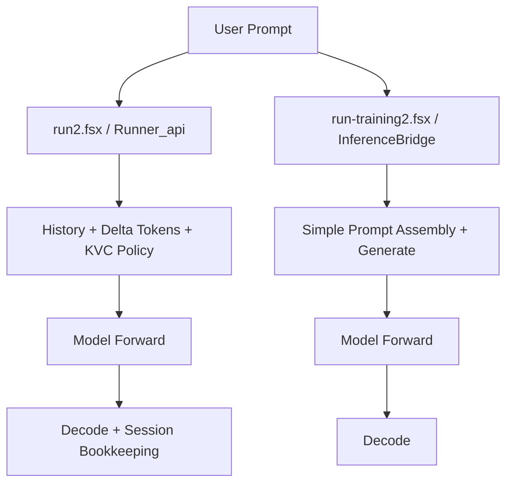
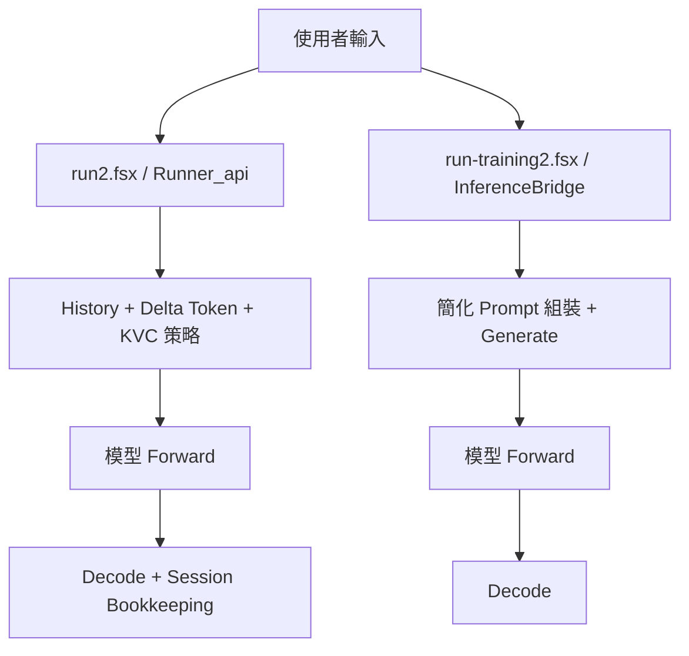

# DevLog

## 2026-02-12
### Context
- Source note: `notes/00001.txt`
- Goal: move `run-training.fsx` from runnable scaffold output to semantic output closer to `run2.fsx`.
- Constraint: no dependency on `Qwen3-4B-Instruct-2507-TorchSharp` project or `Qwen3.dll`.

### Findings From Note/Code Review
- Same weight file does not guarantee same output quality unless model wiring + tokenizer + decode path are equivalent.
- Current pure F# inference path had four major gaps:
  - tokenizer mismatch (byte-token fallback)
  - embedding mismatch (handcrafted features)
  - block wiring mismatch (scaffold linear stack)
  - layer coverage mismatch (2-layer fallback)

### Documentation Changes
- Updated `doc/SA.md` with parity gaps and new FR-05..FR-08.
- Updated `doc/SD.md` with inference parity design (`ModelConfigLite`, `Q4WeightBank`, `TokenizerBridge`, `ForwardEngine`).
- Updated `doc/Test.md` with parity-focused test addendum.
- Appended `doc/WBS.md` with WBS-12..WBS-17.

### Technical Direction
- Short-term implementation order:
  1. tokenizer parity (`tokenizer.json`)
  2. embedding lookup parity
  3. Qwen3-like projection wiring (`q/k/v/o`, `gate/up/down`, `lm_head`)
  4. full layer coverage and parity smoke checks

### Change Tracking
- Relevant recent commits:
  - `2e1f3b1` (`Qwen3-4B-Instruct-2507-TorchSharp.fs`): switched inference bridge to pure F# explicit wiring.
  - `a1b686e` (`fsann`): `run-training.fsx` uses pure F# inference DLL only.

### Implementation Update (same day, parity track)
- Implemented in `InferenceBridge.fs`:
  - tokenizer integration via `Tokenizers.DotNet` (`tokenizer.json`)
  - full layer-family loading for 36 layers (`q/k/v/o`, `gate/up/down`) + `lm_head`
  - raw tensor loading from `.dat` for:
    - `model.embed_tokens.weight`
    - per-layer norm weights (`input_layernorm`, `post_attention_layernorm`, `q_norm`, `k_norm`)
    - `model.norm.weight`
  - Qwen3-like forward skeleton with causal attention + MLP
- Validation result:
  - `dotnet build -c Release` passed.
  - `dotnet fsi run-training.fsx --max-tokens 16` now runs full 36-layer path, but output is still repetitive (`!!!!!!!!!!!!!!!`), so semantic parity is not yet reached.
- Current blocker hypothesis:
  - RoPE and exact decode/KV behavior remain missing and likely dominate quality gap.

### Implementation Update #2 (same day, parity track)
- Implemented:
  - added RoPE in attention path (pure F# implementation over `[heads, seq, head_dim]`)
  - switched projection execution from dense dequant matmul to `Q4Linear` NVFP4 path for:
    - `q/k/v/o`
    - `gate/up/down`
    - `lm_head`
  - added BOS prepend and kept assistant-generation prompt template.
- Validation:
  - `run-training.fsx` no longer collapses to token id `0` / repeated `!`.
  - output is now non-trivial but still semantically unstable compared with `run2.fsx`.
- Updated blocker:
  - exact Qwen3 parity still needs stricter alignment for decode/sampling details and KV-path semantics.

## 2026-02-12（中文）
### 背景
- 來源備註：`notes/00001.txt`
- 目標：將 `run-training.fsx` 從「可執行但 scaffold 輸出」推進到語意接近 `run2.fsx`。
- 限制：不可依賴 `Qwen3-4B-Instruct-2507-TorchSharp` 專案與 `Qwen3.dll`。

### 備註/程式審閱結論
- 同一份權重若模型接線、tokenizer、解碼流程不一致，語意品質不會一致。
- 目前 pure F# 推論路徑有四個主要缺口：
  - tokenizer 不一致（byte-token fallback）
  - embedding 不一致（手工特徵）
  - block 接線不一致（scaffold 線性堆疊）
  - 層覆蓋不一致（2 層 fallback）

### 文件修訂
- `doc/SA.md`：新增 parity gap 與 FR-05..FR-08。
- `doc/SD.md`：新增推論一致性設計（`ModelConfigLite`, `Q4WeightBank`, `TokenizerBridge`, `ForwardEngine`）。
- `doc/Test.md`：新增 parity 導向測試補充。
- `doc/WBS.md`：append WBS-12..WBS-17。

### 技術路線
- 短期實作順序：
  1. 對齊 tokenizer（`tokenizer.json`）
  2. 對齊 embedding lookup
  3. 實作 Qwen3-like projection 接線（`q/k/v/o`, `gate/up/down`, `lm_head`）
  4. 補齊全層載入與 parity smoke 測試

### 變更追蹤
- 近期相關 commit：
  - `2e1f3b1`（`Qwen3-4B-Instruct-2507-TorchSharp.fs`）：InferenceBridge 改為 pure F# 明確接線。
  - `a1b686e`（`fsann`）：`run-training.fsx` 僅使用 pure F# inference DLL。

### 實作更新（同日，parity 路線）
- `InferenceBridge.fs` 已補上：
  - 以 `Tokenizers.DotNet` 讀取 `tokenizer.json`
  - 載入 36 層完整投影族群（`q/k/v/o`, `gate/up/down`）與 `lm_head`
  - 從 `.dat` 載入 raw tensor：
    - `model.embed_tokens.weight`
    - 每層 norm 權重（`input_layernorm`, `post_attention_layernorm`, `q_norm`, `k_norm`）
    - `model.norm.weight`
  - Qwen3-like forward 骨架（causal attention + MLP）
- 驗證結果：
  - `dotnet build -c Release` 通過。
  - `dotnet fsi run-training.fsx --max-tokens 16` 可跑滿 36 層，但輸出仍偏重複（`!!!!!!!!!!!!!!!`），尚未達到語意 parity。
- 目前阻塞推測：
  - RoPE 與精確 decode/KV 行為尚未補齊，應是語意落差主要來源。

### 實作更新 #2（同日，parity 路線）
- 已補上：
  - attention 路徑 RoPE（pure F#，作用於 `[heads, seq, head_dim]`）
  - 投影計算改走 `Q4Linear` NVFP4 路徑，不再使用 dense dequant matmul：
    - `q/k/v/o`
    - `gate/up/down`
    - `lm_head`
  - 補上 BOS prepend 與 assistant generation prompt template。
- 驗證：
  - `run-training.fsx` 已不再退化成 token id `0` 或連續 `!`。
  - 目前輸出雖然非 trivial，但與 `run2.fsx` 相比語意仍不穩定。
- 最新阻塞：
  - 要達成嚴格 parity，仍需對齊 decode/sampling 細節與 KV-path 語意。

### 實作更新 #3（同日，parity 路線）
- 問題定位：
  - `run-training.fsx` 的 `Q4Linear` NVFP4 路徑語意失真，`run2.fsx` 同權重可正常輸出。
  - 差異點確認為 native interop 路徑：`TorchSharp.Q4.Extension` 原先走 `LibTorchSharp` 的 `THSFP4_quantize/THSTensor_scaled_mm` 包裝；`run2` 實際可用路徑為 `libNVFP4.so` 直接呼叫。
- 修正內容：
  - 在 `TorchSharp.Q4.Extension/NativeInterop.fs` 改為直接使用 `NVFP4_quantize`、`NVFP4_scaled_mm`。
  - `InferenceBridge.fs` 同步對齊：
    - 以 `[B,H,T,D]` 形狀走 `scaled_dot_product_attention`；
    - 取消 BOS prepend，與 `run2` prompt 編碼行為一致；
    - `temperature <= 0` 時改為 greedy (`argmax`)。
- 驗證結果（同 prompt）：
  - `run2.fsx`: 維持可讀語意輸出。
  - `run-training.fsx`: 已從亂碼/多語碎片提升為可讀且語意合理句子：
    - `I’ve never seen a UFO, but I’ve spent countless nights wondering what it would be like to encounter one.`

## 2026-02-12 (run-training2 stall analysis and fix)
### Symptom
- `run-training2.fsx` could appear to "hang" around turn `[3]` or `[5]` when using default settings.

### Root Cause (combined factors)
- Full-prompt replay decode path in `run-training2`: each token step re-runs the entire accumulated prompt, so latency grows per turn.
- Stop token mismatch: generation did not consistently stop on `<|im_end|>` (`151645`) and `<|endoftext|>` (`151643`), increasing long-tail decode.
- Timeout model with `Task.Run + Wait(timeout)`: timeout could throw while the background task kept running, leaving residual CPU/GPU load.
- Host-side append overhead: repeated list concatenation (`list @`) in the generation loop created avoidable O(n^2)-style overhead.

### Changes
- `InferenceBridge.fs`
  - Added explicit stop-token flow for rendered prompt generation.
  - Aligned default stop tokens to `151645/151643`.
  - Replaced per-step list append with `ResizeArray` for running/generated token buffers.
- `run-training2.fsx`
  - Replaced background timeout wrapper with same-thread execution and over-budget warning.
  - Aligned rendered prompt path and stop tokens to `151645/151643`.
  - Reduced default `--max-tokens` from `64` to `20` for full-prompt replay stability.
  - Added per-turn prompt token count timing output.

### Validation
- Condition: `--KVCacheOut false --timing true --max-tokens 20`
- `run2.fsx`: `ELAPSED=28.407s`
- `run-training2.fsx`: `ELAPSED=36.835s`
- Outcome: `[5]` no longer stalls; script runs through `[6]` and exits at designed `stop  here`.

### Change Tracking
- `8d7af00` (`Qwen3-4B-Instruct-2507-TorchSharp.fs`): stabilize rendered prompt generation + stop token behavior.
- `c988023` (`fsann`): make `run-training2` complete reliably on FP4 path.

## 2026-02-12（run-training2 卡住分析與修正）
### 現象
- `run-training2.fsx` 在預設設定下，可能在第 `[3]` 或 `[5]` 輪看起來「卡住」。

### 根因（多因素疊加）
- `run-training2` 採 full-prompt replay：每個 token 都重跑整段累積 prompt，輪次越後面越慢。
- stop token 不一致：未穩定以 `<|im_end|>`（`151645`）與 `<|endoftext|>`（`151643`）停止，增加長尾生成。
- `Task.Run + Wait(timeout)` 超時模型：拋例外後背景任務可能仍在執行，造成 CPU/GPU 殘留負載。
- host 端 append 開銷：生成迴圈反覆 `list @`，帶來可避免的 O(n^2) 級開銷。

### 修正內容
- `InferenceBridge.fs`
  - 新增 rendered prompt 生成的 stop-token 控制流程。
  - 預設 stop token 對齊為 `151645/151643`。
  - 生成 token buffer 由 list append 改為 `ResizeArray`。
- `run-training2.fsx`
  - timeout 包裝改為同執行緒執行，超時只警告不留下背景殘留任務。
  - rendered prompt 與 stop token 對齊為 `151645/151643`。
  - full-prompt replay 預設 `--max-tokens` 由 `64` 降至 `20`。
  - 新增每輪 prompt token 數與時間輸出。

### 驗證
- 條件：`--KVCacheOut false --timing true --max-tokens 20`
- `run2.fsx`：`ELAPSED=28.407s`
- `run-training2.fsx`：`ELAPSED=36.835s`
- 結果：`[5]` 不再卡住，可跑到 `[6]`，並在設計的 `stop  here` 結束。

### 變更追蹤
- `8d7af00`（`Qwen3-4B-Instruct-2507-TorchSharp.fs`）：穩定 rendered prompt 生成與 stop token 行為。
- `c988023`（`fsann`）：修正 `run-training2` 使 FP4 路徑可穩定完成。

## 2026-02-12 (memory fluctuation review from `notes/00002.txt`)
### Symptom
- `run-training2.fsx` showed large and unstable GPU memory footprint (roughly `96~116 GiB` observed by `nvidia-smi` in the reported environment).

### Review Conclusion
- Not all growth indicates a hard leak; a significant part can be CUDA allocator reservation behavior.
- Still, there were identifiable lifecycle gaps that could amplify peak/reserved memory drift.

### Fixes Applied
- NVFP4 kernel temp tensor lifecycle hardening:
  - explicitly scoped `qweight.t()` with `use`.
  - explicitly disposed temporary `inputOnDevice` when created via `.to(...)`.
  - disposed intermediate reshaped tensor on dtype conversion branch.
- Added native cache control hook:
  - exposed `NVFP4_empty_cache` via `NativeInterop.tryEmptyNvfp4Cache()`.
- Added runner-level mitigation:
  - `run-training2.fsx` now supports `--empty-cache-each-turn` (default `true`) to clear allocator cache between turns.
  - KV flags remain available (`--KVCacheOut`, `--TokenByTokenOrPromptByPrompt`).

### Residual Risk
- `run-training2` still rebuilds full prompt history each turn; even with per-turn KV path, long-history prefill pressure can still raise memory peaks.
- A persistent cross-turn KV-cache architecture is still recommended for tighter memory stability.

### Change Tracking
- Q4 extension commit: `7cbed57` (`TorchSharp_In_DGX_Spark_fp4/TorchSharp.Q4.Extension`)
- Runner commit: `45bdfbf` (`fsann`)
- Note: push status in that execution window was blocked by DNS resolution failure (`github.com` unresolved).

## 2026-02-12（`notes/00002.txt` 記憶體波動審閱）
### 現象
- `run-training2.fsx` 在回報環境中出現明顯且不穩定的顯存占用（`nvidia-smi` 觀測約 `96~116 GiB` 區間）。

### 審閱結論
- 並非所有成長都代表硬性 leak；相當部分可能是 CUDA allocator 的保留策略。
- 但程式確實存在會放大峰值/保留量波動的生命週期缺口，已進行修補。

### 已套用修正
- NVFP4 kernel 暫存 tensor 生命週期強化：
  - `qweight.t()` 明確以 `use` 受控。
  - `.to(...)` 產生的 `inputOnDevice` 在必要時顯式釋放。
  - dtype 轉換分支中的中間 `reshaped` 顯式釋放。
- native cache 控制介面補齊：
  - 透過 `NativeInterop.tryEmptyNvfp4Cache()` 暴露 `NVFP4_empty_cache`。
- runner 緩解機制：
  - `run-training2.fsx` 新增 `--empty-cache-each-turn`（預設 `true`），每輪後可清 allocator cache。
  - 同時保留 KV 參數路徑（`--KVCacheOut`、`--TokenByTokenOrPromptByPrompt`）。

### 殘餘風險
- `run-training2` 仍是「每輪重建 full prompt history」腳本；即便單輪使用 KV，長歷史 prefill 壓力仍可能推高峰值。
- 若要更穩定壓峰值，仍建議改為跨輪持久 KV-cache 架構。

### 變更追蹤
- Q4 extension commit：`7cbed57`（`TorchSharp_In_DGX_Spark_fp4/TorchSharp.Q4.Extension`）
- runner commit：`45bdfbf`（`fsann`）
- 備註：該次執行窗口因 DNS 解析失敗（`github.com` 無法解析）導致 push 阻塞。

## 2026-02-12 (KVC instability / intermittent segfault follow-up)
### User-reported symptom
- Sequence observed:
  1. run `run-training2.fsx` with `--KVCacheOut false` (often completes to designed `stop here`)
  2. immediately run again (or switch to `--KVCacheOut true`)
  3. intermittently stalls around `[5]` or crashes with SIGSEGV
- Crash signature: stack in `libtorch_cpu.so` (`at::to_copy/copy_`) via `THSTensor_to_device`.

### What changed recently (scope)
- `Qwen3-4B-Instruct-2507-TorchSharp.fs`:
  - `1679c7d`: introduced KV-cache generation path (`generate...KvCache`) and default UM disabled behavior.
- `fsann`:
  - `647f2c3`: wired `run-training2.fsx` to support `KVCacheOut` + prefill mode.
  - `45bdfbf`: enabled per-turn `NVFP4_empty_cache` switch (default true).
  - `30d24c3`: removed reflection workaround; direct `TorchSharp.Q4.Extension` reference.

### Root-cause analysis (current confidence)
- Most likely issue is native allocator pressure/fragility during repeated large tensor host->device transfers in init/load path, not a deterministic KVC logic bug alone.
- Specific defect fixed:
  - `Nvfp4State.readTensorAsByte` created a temporary CPU tensor, copied to CUDA, but did not dispose the CPU temporary in CUDA path.
  - Repeated full-file scans in init can amplify this pressure.

### Fixes applied now
- `Nvfp4State.fs`
  - release temporary CPU tensor immediately after `.to(device)` copy.
- `InferenceBridge.fs`
  - reduce repeated `.dat` scans during init:
    - reuse one load result for `k_proj/v_proj` map extraction.
    - reuse one load result for `gate_proj/up_proj` map extraction.
  - expected impact: fewer allocation spikes and less init-time instability.

### Verification snapshot
- `dotnet build -c Release Qwen3-4B-Instruct-2507-TorchSharp.fs.fsproj`: PASS.
- `run-training2.fsx` smoke:
  - `--KVCacheOut false --timing true`: PASS to designed `stop here`.
  - `--KVCacheOut true --timing true`: PASS to designed `stop here`.

### Open risk
- SIGSEGV is intermittent and native-side; cannot claim complete closure from one pass.
- Need stress loop validation (`N>=10`) for both `KVC on/off` with same prompt set.

## 2026-02-12（KVC 不穩定 / 間歇性 segfault 追蹤）
### 使用者回報現象
- 觀察序列：
  1. 先跑 `run-training2.fsx --KVCacheOut false`（通常可到設計的 `stop here`）
  2. 立即再跑一次（或改成 `--KVCacheOut true`）
  3. 偶發在 `[5]` 卡住，或直接 SIGSEGV
- crash 特徵：`libtorch_cpu.so`（`at::to_copy/copy_`）經由 `THSTensor_to_device`。

### 最近變更範圍
- `Qwen3-4B-Instruct-2507-TorchSharp.fs`：
  - `1679c7d`：加入 KV-cache 生成路徑（`generate...KvCache`）與預設關閉 UM。
- `fsann`：
  - `647f2c3`：`run-training2.fsx` 接入 `KVCacheOut` 與 prefill mode。
  - `45bdfbf`：加入 per-turn `NVFP4_empty_cache`（預設 true）。
  - `30d24c3`：移除反射 workaround，改為直接引用 `TorchSharp.Q4.Extension`。

### 目前根因判斷（信心等級：中）
- 較可能是 init/load 階段重複大量 host->device 轉移帶來的 native allocator 壓力/脆弱性，不是單一可重現的 KVC 邏輯錯誤。
- 已確認並修正的缺陷：
  - `Nvfp4State.readTensorAsByte` 在 CUDA 路徑中，CPU 暫存 tensor `.to(device)` 後未立即釋放。
  - init 期間多次全檔掃描會放大此壓力。

### 本次已套用修正
- `Nvfp4State.fs`
  - `.to(device)` 後立即 `Dispose` CPU 暫存 tensor。
- `InferenceBridge.fs`
  - 減少 init 時重複 `.dat` 掃描：
    - `k_proj/v_proj` 共用一次載入結果再分別抽 map。
    - `gate_proj/up_proj` 共用一次載入結果再分別抽 map。
  - 預期效益：降低配置尖峰與 init 不穩定性。

### 驗證快照
- `dotnet build -c Release Qwen3-4B-Instruct-2507-TorchSharp.fs.fsproj`：PASS。
- `run-training2.fsx` smoke：
  - `--KVCacheOut false --timing true`：可跑到設計的 `stop here`。
  - `--KVCacheOut true --timing true`：可跑到設計的 `stop here`。

### 殘餘風險
- SIGSEGV 屬間歇性 native crash，單次驗證不能宣告完全結案。
- 需補 `N>=10` 壓力回歸（同 prompt、`KVC on/off` 各一組）。

## 2026-02-12 (WBS-16 / WBS-20 closure)
### Deliverables
- Added parity smoke script: `scripts/Tests.Parity.fsx`
- Added KVC stress matrix script: `scripts/Tests.KVCStress.fsx`
- Updated `doc/Test.md` with execution commands and acceptance criteria.
- Updated `doc/WBS.md`: set WBS-16 and WBS-20 to `Done`.

### Results
- `dotnet fsi scripts/Tests.Parity.fsx`
  - PASS (`run2` + `run-training2` first `out:` readable, no segfault, reached designed stop marker)
- `dotnet fsi scripts/Tests.KVCStress.fsx`
  - PASS (`cases=3`, `iterations=3`, `total=9`, no segfault)

## 2026-02-12（WBS-16 / WBS-20 完工）
### 交付內容
- 新增 parity smoke 腳本：`scripts/Tests.Parity.fsx`
- 新增 KVC 壓力矩陣腳本：`scripts/Tests.KVCStress.fsx`
- 更新 `doc/Test.md` 執行方式與驗收標準。
- 更新 `doc/WBS.md`：WBS-16 與 WBS-20 改為 `Done`。

### 驗證結果
- `dotnet fsi scripts/Tests.Parity.fsx`
  - PASS（`run2` 與 `run-training2` 第一個 `out:` 可讀、無 segfault、到達設計 stop）
- `dotnet fsi scripts/Tests.KVCStress.fsx`
  - PASS（`cases=3`、`iterations=3`、`total=9`，無 segfault）

## 2026-02-12 (Managed-UM branch for `TS_Q4_DISABLE_UM=0`)
### Branch
- `feature/um-managed-path-ts-q4-disable-um-0`

### Scope
- Keep existing runtime logic.
- Add managed-memory promotion for persistent inference raw tensors when UM policy is enabled.
- Integrate with upgraded `TorchSharp.Q4.Extension` managed allocator path.

### Code changes
- `InferenceBridge.fs`
  - added `applyUnifiedPolicyToRawMap`.
  - raw tensors from `.dat` now pass through `UnifiedMemory.applyMutablePolicy` under session policy.
  - added init diagnostic line:
    - `[InferInit] UM(raw tensors): managed=<n> total=<m>`

### Validation
- Command:
  - `TS_Q4_DISABLE_UM=0 dotnet fsi /workspace/fsann/alpha/runner-arm64-fp4/run-training2.fsx --max-tokens 1 --timing true`
- Result:
  - PASS to designed `stop here`.
  - Init emitted:
    - `[InferInit] UM(raw tensors): managed=146 total=146`
  - Compatibility check (UM disabled / env unset): PASS to designed `stop here`.

## 2026-02-12（`TS_Q4_DISABLE_UM=0` 的 Managed-UM 分支）
### 分支
- `feature/um-managed-path-ts-q4-disable-um-0`

### 範圍
- 保留既有 runtime 主邏輯。
- 在 UM policy 啟用時，將持久推論 raw tensors 升級為 managed memory。
- 串接升級後的 `TorchSharp.Q4.Extension` managed allocator 路徑。

### 程式調整
- `InferenceBridge.fs`
  - 新增 `applyUnifiedPolicyToRawMap`。
  - `.dat` 載入的 raw tensors 會依 session policy 走 `UnifiedMemory.applyMutablePolicy`。
  - 新增 init 診斷輸出：
    - `[InferInit] UM(raw tensors): managed=<n> total=<m>`

### 驗證
- 指令：
  - `TS_Q4_DISABLE_UM=0 dotnet fsi /workspace/fsann/alpha/runner-arm64-fp4/run-training2.fsx --max-tokens 1 --timing true`
- 結果：
  - 可跑到設計的 `stop here`。
  - init 輸出：
    - `[InferInit] UM(raw tensors): managed=146 total=146`
  - 相容性檢查（UM 關閉 / env 未設定）：可跑到設計的 `stop here`。

## 2026-02-14 (notes/00002 review and next planning)
### Source
- Reviewed: `notes/00002.txt`

### Key conclusion
- Current training graph is still scaffold-style:
  - `Qwen3Model.forward` uses linear stack with `List.fold + linearSte`.
- Current inference graph in `InferenceBridge` already includes Qwen3-like block wiring, but is still not runtime-identical to official C# path.

### Why inference is only "close", not "identical"
- Runtime path difference:
  - pure F# inference path does not call official `Qwen3Dense/Qwen3MoE` pipeline classes.
- Session/cache behavior difference:
  - `run2` C# path has session-level incremental KVC state machine.
  - current `InferenceBridge` KVC is call-local; history/session orchestration is done externally in scripts.
- Sampling/template handling difference:
  - stop-token handling, template/session bookkeeping, and generation trim rules are not fully shared with official pipeline code.

### Decision
- Start a dedicated parity refactor:
  - move training forward from scaffold to full Qwen3 block wiring.
  - extract shared block-forward implementation to avoid train/infer drift.
  - add layer-wise/logits parity tests against the existing run2 route.

## 2026-02-14（notes/00002 審閱與後續規劃）
### 來源
- 已審閱：`notes/00002.txt`

### 核心結論
- 目前訓練圖仍是 scaffold：
  - `Qwen3Model.forward` 仍為 `List.fold + linearSte` 線性堆疊。
- 目前 `InferenceBridge` 雖已是 Qwen3-like block 接線，但尚未與官方 C# runtime 完全同構。

### 為何推論僅「接近」而非「相同」
- Runtime 路徑不同：
  - pure F# 推論未直接走官方 `Qwen3Dense/Qwen3MoE` pipeline 類別。
- Session/cache 行為不同：
  - `run2` 的 C# 路徑有 session 級增量 KVC 狀態機。
  - 目前 `InferenceBridge` 的 KVC 為單次呼叫內快取，跨輪歷史由外部腳本組裝。
- 取樣/模板處理差異：
  - stop token、模板與 session bookkeeping、生成裁切規則，尚未與官方 pipeline 程式碼完全共用。

### 決策
- 啟動專項 parity 重構：
  - 訓練 forward 改為完整 Qwen3 block 接線，移除 scaffold。
  - 抽 shared block-forward，降低 train/infer 漂移。
  - 增加 layer-wise/logits parity 測試，對照現有 run2 路徑。

## 2026-02-14 (clarification: model-block parity vs chat-pipeline parity)
### Clarification
- Current pure F# inference already has Qwen3-like model block wiring (`q/k/v/o`, RoPE, SDPA, MLP).
- But the outer chat/session pipeline is still simplified compared with `run2` route.

### Practical difference
- `run2` path (`Runner_api`) includes session-level orchestration:
  - history accumulation
  - delta-token prefill logic
  - KV-cache reset/append policy
  - assistant end-token bookkeeping
- `run-training2` pure F# path mainly calls `InferenceBridge` generation APIs directly with a lighter orchestration layer.

### Flow sketch


### Implication
- "Model wiring parity" and "chat pipeline parity" are different layers.
- We are close on model-block wiring, but not yet fully identical on session/chat pipeline behavior.

## 2026-02-14（補充：模型接線一致性 vs 對話流程一致性）
### 說明
- 目前 pure F# 推論在模型 block 內部，已具備 Qwen3-like 接線（`q/k/v/o`, RoPE, SDPA, MLP）。
- 但外層 chat/session pipeline 相較 `run2` 仍是簡化版。

### 實際差異
- `run2`（`Runner_api`）有完整 session 級流程：
  - history 累積
  - delta-token prefill 策略
  - KV cache reset/append 規則
  - assistant 結尾 token 的 bookkeeping
- `run-training2` pure F# 路徑目前主要是直接呼叫 `InferenceBridge` 生成 API，外層流程較薄。

### 流程示意


### 結論
- 「模型接線一致」與「對話流程一致」是兩個層次。
- 目前模型接線接近官方，但 session/chat pipeline 尚未完全同構。

## 2026-02-14 (InferenceBridge vs `Qwen3-4B-Instruct-2507-TorchSharp-mod` mapping table)
### Scope
- Comparison target:
  - `InferenceBridge.fs` (pure F# path)
  - `Qwen3-4B-Instruct-2507-TorchSharp-mod` (`Qwen3Attention/Qwen3MLP/Qwen3Block/Qwen3Model`)

### Q/K/V/O and MLP comparison
| Item | `Qwen3-...-mod` | `InferenceBridge` | Gap / Missing |
|---|---|---|---|
| `q_proj` | Yes (`Qwen3Attention`) | Yes (`layer.QProj`) | No major gap in existence |
| `k_proj` | Yes | Yes (`layer.KProj`) | No major gap in existence |
| `v_proj` | Yes | Yes (`layer.VProj`) | No major gap in existence |
| `o_proj` | Yes | Yes (`layer.OProj`) | No major gap in existence |
| `q_norm` / `k_norm` | Yes (`Qwen3RMSNorm`) | Yes (`layer.QNorm/KNorm`) | No major gap in existence |
| RoPE application | Uses `Qwen3RotaryEmbedding.forward(...)` then `ApplyRotaryPosEmb(...)` | Uses local `applyRoPE(...)` | Implementation differs; F# path is text-focused and does not include mod's multimodal rotary branch |
| KV head expansion (`GQA`) | `repeat_interleave` / `RepeatKV` | `expandKvHeads` | Equivalent intent; implementation form differs |
| Cache attention mask when `past!=null` and `T>1` | Explicit `attn_mask` + `useCausal=false` | Only `useCausal` toggle, no explicit mask branch | **Missing parity detail** (prompt-chunk prefill semantics can diverge) |
| Max context clipping | Clips `k/v` to `maxContext`, updates `PositionOffset` | No `maxContext` clipping in `InferenceBridge` cache path | **Missing parity detail** (long-context behavior diverges) |
| MLP `gate/up/down` | `silu(gate(x)) * up(x) -> down(...)` | Same formula (`silu(gate) * up -> down`) | No major gap in dense MLP math |
| MoE path | Dense + MoE variants exist | Dense-style path only | **Missing feature** if MoE parity is required |
| Final norm + lm_head | Yes | Yes (`lastNorm + LmHead`) | No major gap in existence |

### Summary
- For requested core parts (`q/k/v/o`, MLP), `InferenceBridge` already has corresponding modules and formula.
- Current missing parity points are around cache/runtime semantics:
  - past+chunk attention mask branch
  - max-context clipping/position offset
  - full session-level orchestration

### NVFP4 storage vs compute dtype comparison
| Stage | `Qwen3-...-mod` (C# + `Qwen3.FP4.Extension`) snippet | `InferenceBridge` (`TorchSharp.Q4.Extension`) snippet |
|---|---|---|
| Weight file (`.dat`) | `var qKey = prefix + ".qdata"; var sKey = prefix + ".scale";` | `match format with NVFP4 -> prefix + ".qdata", Some (prefix + ".scale"), None, None` |
| In-memory weight (ready) | `_qweight <- qweight.detach().contiguous().to(Device(device))` / `_scale <- Fp4Ops.to_blocked ...` | `new PreparedNvfp4KernelWeight(... packed, scaleBlocked, inFeatures, outFeatures)` |
| Forward input handling | `let qinput0, iscale0 = Fp4Ops.quantize in2d` | `let qInputRaw, inputScaleRaw = NativeInterop.fp4Quantize input2d` |
| Core matmul | `Fp4Ops.scaled_mm qinput (_qweight.t()) iscale_swiz _scale input.dtype` | `NativeInterop.scaledMmFp4 qInput qweightT inputScaleBlocked scaleBlocked outDtype` |
| Default output dtype in runner | `--dtype float16` (default args in `run2.fsx`) | `--dtype float16` (default args in `run-training2.fsx`) |
| Where float/bf16 appears | `... scaled_mm ... input.dtype` (output follows input dtype), debug path has `to_type(Float32)` for A/B | `let computeDtype = ensureComputeDtype ...` then `linear(...)`; kernel output cast by `outDtype` |
| Full float fallback path | `deqW = Fp4Ops.dequantize_weight ...` then `torch.matmul(inputF, deqWF...)` (A/B) | `let output = torch.nn.functional.linear(inputForCompute, weightForCompute)` |

### Key snippets (stable by symbol, not line number)
```fsharp
// fsann/Qwen3.FP4.Extension/Library.fs
_qweight <- qweight.detach().contiguous().``to``(Device(device)).MoveToOuterDisposeScope()
_scale <- Fp4Ops.to_blocked scaleTmp
let qinput0, iscale0 = Fp4Ops.quantize in2d
let outTmp = Fp4Ops.scaled_mm qinput (_qweight.t()) iscale_swiz _scale input.dtype
```

```fsharp
// TorchSharp_In_DGX_Spark_fp4/TorchSharp.Q4.Extension/Backend.fs
let qInputRaw, inputScaleRaw = NativeInterop.fp4Quantize input2d
use out2d = NativeInterop.scaledMmFp4 qInput qweightT inputScaleBlocked scaleBlocked outDtype
let output = torch.nn.functional.linear(inputForCompute, weightForCompute) // fallback
```

## 2026-02-14（`InferenceBridge` 與 `Qwen3-...-mod` 對照表）
### 範圍
- 對照目標：
  - `InferenceBridge.fs`（pure F# 路徑）
  - `Qwen3-4B-Instruct-2507-TorchSharp-mod`（`Qwen3Attention/Qwen3MLP/Qwen3Block/Qwen3Model`）

### Q/K/V/O 與 MLP 對照
| 項目 | `Qwen3-...-mod` | `InferenceBridge` | 差異/缺漏 |
|---|---|---|---|
| `q_proj` | 有（`Qwen3Attention`） | 有（`layer.QProj`） | 存在性無主要缺口 |
| `k_proj` | 有 | 有（`layer.KProj`） | 存在性無主要缺口 |
| `v_proj` | 有 | 有（`layer.VProj`） | 存在性無主要缺口 |
| `o_proj` | 有 | 有（`layer.OProj`） | 存在性無主要缺口 |
| `q_norm` / `k_norm` | 有（`Qwen3RMSNorm`） | 有（`layer.QNorm/KNorm`） | 存在性無主要缺口 |
| RoPE 套用 | 先 `Qwen3RotaryEmbedding.forward(...)` 再 `ApplyRotaryPosEmb(...)` | 使用本地 `applyRoPE(...)` | 實作不同；F# 路徑為 text-focused，未含 mod 的 multimodal rotary 分支 |
| KV head 展開（GQA） | `repeat_interleave` / `RepeatKV` | `expandKvHeads` | 意圖等價，實作形式不同 |
| `past!=null` 且 `T>1` 的 cache 注意力遮罩 | 有明確 `attn_mask` + `useCausal=false` | 目前僅切 `useCausal`，無明確 mask 分支 | **一致性缺口**（prompt-chunk prefill 語意可能偏移） |
| `maxContext` 裁切 | 會裁切 `k/v` 並更新 `PositionOffset` | `InferenceBridge` cache 路徑未做 `maxContext` 裁切 | **一致性缺口**（長上下文行為偏移） |
| MLP `gate/up/down` | `silu(gate(x)) * up(x) -> down(...)` | 同公式（`silu(gate) * up -> down`） | dense MLP 數學上無主要缺口 |
| MoE 路徑 | 有 Dense + MoE 變體 | 目前僅 Dense 風格路徑 | 若要 MoE parity 則是**缺功能** |
| Final norm + lm_head | 有 | 有（`lastNorm + LmHead`） | 存在性無主要缺口 |

### 結論
- 你指定的核心段（`q/k/v/o`, MLP）在 `InferenceBridge` 已有對應，公式也對。
- 目前主要缺口在 cache/runtime 語意：
  - past+chunk 的注意力遮罩分支
  - max-context 裁切與 position offset
  - 完整 session 級流程控制

### NVFP4 儲存 vs 計算 dtype 對照
| 階段 | `Qwen3-...-mod`（C# + `Qwen3.FP4.Extension`）關鍵片段 | `InferenceBridge`（`TorchSharp.Q4.Extension`）關鍵片段 |
|---|---|---|
| 權重檔（`.dat`） | `var qKey = prefix + ".qdata"; var sKey = prefix + ".scale";` | `match format with NVFP4 -> prefix + ".qdata", Some (prefix + ".scale"), None, None` |
| 記憶體中的權重（就緒） | `_qweight <- qweight.detach().contiguous().to(Device(device))` / `_scale <- Fp4Ops.to_blocked ...` | `new PreparedNvfp4KernelWeight(... packed, scaleBlocked, inFeatures, outFeatures)` |
| Forward 輸入處理 | `let qinput0, iscale0 = Fp4Ops.quantize in2d` | `let qInputRaw, inputScaleRaw = NativeInterop.fp4Quantize input2d` |
| 核心 matmul | `Fp4Ops.scaled_mm qinput (_qweight.t()) iscale_swiz _scale input.dtype` | `NativeInterop.scaledMmFp4 qInput qweightT inputScaleBlocked scaleBlocked outDtype` |
| runner 預設輸出 dtype | `--dtype float16`（`run2.fsx` defaultArgs） | `--dtype float16`（`run-training2.fsx` defaultArgs） |
| 哪裡會出現 float/bf16 | `... scaled_mm ... input.dtype`（輸出跟 input dtype），A/B 路徑會 `to_type(Float32)` | `let computeDtype = ensureComputeDtype ...` 再 `linear(...)`；kernel 路徑由 `outDtype` 決定輸出 |
| 全浮點 fallback 路徑 | `deqW = Fp4Ops.dequantize_weight ...` + `torch.matmul(inputF, deqWF...)`（A/B） | `let output = torch.nn.functional.linear(inputForCompute, weightForCompute)` |

### 關鍵程式碼片段（以符號定位，不依賴行號）
```fsharp
// fsann/Qwen3.FP4.Extension/Library.fs
_qweight <- qweight.detach().contiguous().``to``(Device(device)).MoveToOuterDisposeScope()
_scale <- Fp4Ops.to_blocked scaleTmp
let qinput0, iscale0 = Fp4Ops.quantize in2d
let outTmp = Fp4Ops.scaled_mm qinput (_qweight.t()) iscale_swiz _scale input.dtype
```

```fsharp
// TorchSharp_In_DGX_Spark_fp4/TorchSharp.Q4.Extension/Backend.fs
let qInputRaw, inputScaleRaw = NativeInterop.fp4Quantize input2d
use out2d = NativeInterop.scaledMmFp4 qInput qweightT inputScaleBlocked scaleBlocked outDtype
let output = torch.nn.functional.linear(inputForCompute, weightForCompute) // fallback
```

### Maintenance note
- Canonical, standalone version is now maintained in `doc/NVFP4_DataPath.md` (EN + ZH, snippet-first).

## 2026-02-14 (Functional training operator migration planning)
### Context
- User requested training graph wiring to adopt TorchSharp.Fun / DiffSharp-like functional operators:
  - sequential style (`->>`)
  - application style (`-->`)
- Constraint: inference path must remain unchanged.

### Reference review (cloned locally)
- `https://github.com/fwaris/TorchSharp.Fun`
  - reviewed `TorchSharp.Fun/TorchSharp.Fun.fs`
  - key idea used: operator-driven stage composition (`->>`).
- `https://github.com/diffsharp/DiffSharp`
  - reviewed operator usage and docs examples (`-->`) for branch/merge friendly functional graph expression.

### Design decision
- Implement in-project minimal FP operator module for training path (`TrainingFunctional.fs`) instead of importing external full source.
- Keep runtime semantics unchanged:
  - no inference behavior change
  - no quantization-path rewrite
  - only wiring style migration for training graph.

### Planned implementation
- Add `TensorOp` and operators (`->>`, `-->`).
- Add combinators (`chain`, `residual`, `parallel2`, `merge2`) for complex graph form.
- Refactor `Qwen3Model.forward` to construct training graph with operators.
- Validate with build + existing training/inference scripts.

## 2026-02-14（訓練 functional operator 遷移規劃）
### 背景
- 使用者要求訓練圖接線改為 TorchSharp.Fun / DiffSharp 類型的功能式 operator：
  - 串接風格（`->>`）
  - 套用風格（`-->`）
- 限制：推論路徑必須保持不變。

### 參考評估（已本地 clone）
- `https://github.com/fwaris/TorchSharp.Fun`
  - 已審閱 `TorchSharp.Fun/TorchSharp.Fun.fs`
  - 採用重點：operator 驅動的 stage composition（`->>`）。
- `https://github.com/diffsharp/DiffSharp`
  - 已審閱 `-->` 在 docs/examples 的使用方式，作為 branch/merge 形式參考。

### 設計決策
- 不直接整包匯入外部程式碼，改在專案內實作最小化訓練專用 FP operator 模組（`TrainingFunctional.fs`）。
- runtime 語意不變：
  - 推論行為不改
  - 量化計算路徑不改
  - 本次只做訓練圖「接線風格」遷移。

### 預計實作
- 新增 `TensorOp` 與 operators（`->>`, `-->`）。
- 新增 combinators（`chain`, `residual`, `parallel2`, `merge2`）支援複雜接線。
- 重構 `Qwen3Model.forward` 以 operator 組線執行。
- 以 build + 既有訓練/推論腳本做驗證。

## 2026-02-14 (Functional training operator migration implementation)
### Implemented
- Added `TrainingFunctional.fs`:
  - `TensorOp`, `TensorPairOp`
  - operators: `->>`, `-->`
  - combinators: `id`, `stage`, `chain`, `residual`, `parallel2`, `merge2`
  - NVFP4 adapter: `linearSte weight outDtype`
- Updated project compile order:
  - `Qwen3-4B-Instruct-2507-TorchSharp.fs.fsproj` now includes `TrainingFunctional.fs`.
- Refactored training wiring:
  - `Qwen3Model.forward` now builds training graph with operator composition (`stage` + `chain`) and executes via `input --> trainingGraph`.
  - Removed scaffold-style direct `List.fold` wiring path.

### Validation
- Build:
  - `dotnet build -c Release Qwen3-4B-Instruct-2507-TorchSharp.fs.fsproj` => success.
- Training-path regression:
  - `dotnet fsi scripts/Tests.CPU.fsx` => all checks passed (9/9).
- Inference smoke (unchanged behavior check):
  - `cd /workspace/fsann/alpha/runner-arm64-fp4 && dotnet fsi run-training2.fsx --max-tokens 4 --timing true`
  - generation/logits flow completed; script ended with `stop here` exception by design.

## 2026-02-14（訓練 functional operator 遷移實作）
### 已完成
- 新增 `TrainingFunctional.fs`：
  - `TensorOp`, `TensorPairOp`
  - operators：`->>`, `-->`
  - combinators：`id`, `stage`, `chain`, `residual`, `parallel2`, `merge2`
  - NVFP4 adapter：`linearSte weight outDtype`
- 更新專案編譯順序：
  - `Qwen3-4B-Instruct-2507-TorchSharp.fs.fsproj` 已納入 `TrainingFunctional.fs`。
- 訓練接線重構：
  - `Qwen3Model.forward` 改為 operator 組線（`stage` + `chain`），以 `input --> trainingGraph` 執行。
  - 移除原本 scaffold 直接 `List.fold` 接線。

### 驗證
- Build：
  - `dotnet build -c Release Qwen3-4B-Instruct-2507-TorchSharp.fs.fsproj` => 成功。
- 訓練路徑回歸：
  - `dotnet fsi scripts/Tests.CPU.fsx` => 全部通過（9/9）。
- 推論 smoke（確認未改行為）：
  - `cd /workspace/fsann/alpha/runner-arm64-fp4 && dotnet fsi run-training2.fsx --max-tokens 4 --timing true`
  - 生成與 logits 流程完成；腳本最終拋 `stop here` 為設計行為。

## 2026-02-14 (WBS-26/27 kickoff: shared block core)
### Implemented
- Added new shared block module:
  - `Qwen3Core.fs` with:
    - `CoreConfig`
    - `BlockNorms`
    - `BlockProjections`
    - `forwardBlockNoCache`
- Integrated no-cache inference block path:
  - `InferenceBridge.forwardLayer` now delegates to `Qwen3Core.forwardBlockNoCache`.
  - cache path (`forwardLayerWithCache`) remains unchanged in this step.

### Scope clarification
- This step starts WBS-27 but does not complete it yet:
  - shared core is now used by inference no-cache path.
  - training path has not yet been migrated to call this core.

### WBS impact
- WBS-26 set to Done (contract frozen in SD).
- WBS-27 moved to In Progress.

## 2026-02-14（WBS-26/27 開工：shared block core）
### 已完成
- 新增 shared block 模組：
  - `Qwen3Core.fs`，包含：
    - `CoreConfig`
    - `BlockNorms`
    - `BlockProjections`
    - `forwardBlockNoCache`
- 推論 no-cache block 路徑改為共用核心：
  - `InferenceBridge.forwardLayer` 已改為呼叫 `Qwen3Core.forwardBlockNoCache`。
  - cache 路徑（`forwardLayerWithCache`）此階段先保持原樣。

### 範圍說明
- 此步驟是 WBS-27 的起始，不是完工：
  - shared core 已被推論 no-cache 路徑使用。
  - 訓練路徑尚未遷移到同一核心。

### WBS 影響
- WBS-26 改為 Done（SD 已凍結契約）。
- WBS-27 改為 In Progress。

## 2026-02-14 (WBS-27/28 complete: operator-graph block + training path hookup)
### Implemented
- `TrainingFunctional.fs`
  - generalized operator composition to generic `Op<'a,'b>`
  - added branch/merge helpers for block graph:
    - `parallel3`, `merge3`
- `Qwen3Core.fs`
  - added `buildBlockGraphNoCache` using `TrainingFunctional` operators:
    - attention main path: `input_norm -> (q/k/v branch) -> attn merge`
    - residual #1 via `residual`
    - MLP main path: `post_norm -> (gate/up branch) -> silu* -> down`
    - residual #2 via `residual`
  - `forwardBlockNoCache` now executes `hidden --> blockGraph`.
- `Qwen3Model.fs`
  - training model now includes `Blocks` metadata and `ExtraParameters`.
  - training forward now runs through the same `Qwen3Core.buildBlockGraphNoCache`.
  - for current scaffold/synthetic training state, each square trainable layer is adapted into a block-compatible projection set (shared projection parameter + trainable norm parameters) so the training path can execute the same block graph API.
- `InferenceBridge.fs`
  - no-cache block path already delegated to shared core from previous step.

### Validation
- `dotnet build -c Release Qwen3-4B-Instruct-2507-TorchSharp.fs.fsproj` => success.
- `dotnet fsi scripts/Tests.CPU.fsx` => all checks passed.
- `dotnet fsi /workspace/fsann/alpha/runner-arm64-fp4/run-training2.fsx --max-tokens 4 --timing true` => generation/logits flow still works; ends with designed `stop here`.

### WBS status update
- WBS-27 => Done
- WBS-28 => Done
- WBS-29/30 remain pending

## 2026-02-14（WBS-27/28 完工：operator-graph block + 訓練路徑接線）
### 已完成
- `TrainingFunctional.fs`
  - operator 組合泛化為 `Op<'a,'b>`
  - 新增 block 圖所需 branch/merge：
    - `parallel3`, `merge3`
- `Qwen3Core.fs`
  - 新增 `buildBlockGraphNoCache`，以 `TrainingFunctional` operators 建圖：
    - attention 主路徑：`input_norm -> (q/k/v 分支) -> attn merge`
    - 殘差 #1：`residual`
    - MLP 主路徑：`post_norm -> (gate/up 分支) -> silu* -> down`
    - 殘差 #2：`residual`
  - `forwardBlockNoCache` 改為 `hidden --> blockGraph` 執行。
- `Qwen3Model.fs`
  - 訓練模型新增 `Blocks` 與 `ExtraParameters`。
  - 訓練 forward 改為呼叫同一份 `Qwen3Core.buildBlockGraphNoCache`。
  - 目前 scaffold/synthetic 訓練 state 下，將 square 線性層適配為 block 可用投影集合（共享 projection 參數 + 可訓練 norm 參數），讓訓練路徑可執行同一套 block graph API。
- `InferenceBridge.fs`
  - no-cache block 路徑延續前一步，已共用 shared core。

### 驗證
- `dotnet build -c Release Qwen3-4B-Instruct-2507-TorchSharp.fs.fsproj` => 成功。
- `dotnet fsi scripts/Tests.CPU.fsx` => 全通過。
- `dotnet fsi /workspace/fsann/alpha/runner-arm64-fp4/run-training2.fsx --max-tokens 4 --timing true` => 生成/logits 流程仍正常，最後為設計行為 `stop here`。

### WBS 狀態更新
- WBS-27 => Done
- WBS-28 => Done
- WBS-29/30 仍 Pending

## 2026-02-22 (Training graph explicitness + KV-cache path added)
### Why the graph was "not fully explicit"
- Current design grouped two high-fanout subgraphs into single stages:
  - `qkvContextStage` (q/k/v projection + attn context assembly)
  - `gateUpMergeStage` (gate/up projection + SiLU merge)
- Original reason:
  - keep operator graph readable and stable while migrating from scaffold to FP-style.
  - keep one swap point between no-cache and cache implementation without duplicating all stage wiring.
  - reduce closure/dependent-module churn in `IModel` composition.
- Tradeoff:
  - less visual verbosity than fully split `qStage -> kStage -> vStage -> merge`.
  - easier maintenance for parity and runtime-path switches.

### KV-cache added to training block graph
- Added cache data structures in `Qwen3Core.fs`:
  - `BlockKvCache`
  - `ModelKvCache`
- Added cache-aware block graph:
  - `buildBlockGraphWithCache`
  - `forwardBlockWithCache`
- Added model-level cache API in `Qwen3Model.fs`:
  - `createKvCache`
  - `resetKvCache`
  - `forwardWithKvCache`
- Added trainer switches in `TrainingConfig` / CLI:
  - `UseKvCache` (`--use-kvc`)
  - `SequenceLength` (`--seq-len`)
- Current training default remains no-cache; cache path is opt-in.

### Synthetic hidden->hidden path (current code, near-complete)
```fsharp
// Trainer.createBatch
let inputShape, targetShape =
  if useKvCache then
    [| batchSize; sequenceLength; inFeatures |], [| batchSize; sequenceLength; outFeatures |]
  else
    [| batchSize; inFeatures |], [| batchSize; outFeatures |]
let input = torch.randn(inputShape, dtype = dtype, device = device)
let target = torch.randn(targetShape, dtype = dtype, device = device)
```

```fsharp
// Trainer.run (forward path switch)
use output =
  if cfg.UseKvCache && model.Blocks.Length > 0 then
    use cache = Qwen3Model.createKvCache model
    Qwen3Model.forwardWithKvCache model cache inputTensor (Some computeDtype)
  else
    Qwen3Model.forward model inputTensor (Some computeDtype)
use loss = scalarLoss output targetTensor
```

```fsharp
// Trainer.scalarLoss (synthetic hidden->hidden objective)
use diff = output - targetForLoss
use absDiff = diff.abs()
let loss = absDiff.mean()
```

## 2026-02-22（訓練圖顯式度 + 新增 KV-cache 路徑）
### 為何目前不是「完全顯式」拆法
- 目前把兩個高扇出子圖打包為 stage：
  - `qkvContextStage`（q/k/v 投影 + attention context）
  - `gateUpMergeStage`（gate/up 投影 + SiLU merge）
- 當初設計原因：
  - 從 scaffold 遷移到 FP-style 時，先維持可讀且穩定的 operator graph。
  - 讓 no-cache/cache 只在單一交換點切換，避免整段 stage 重複。
  - 降低 `IModel` 組裝時 closure/相依註冊數量。
- 取捨：
  - 視覺上比完全拆成 `qStage -> kStage -> vStage -> merge` 更短。
  - 維護 parity 與 runtime-path 切換成本較低。

### 已加入訓練用 KV-cache 路徑
- `Qwen3Core.fs` 新增快取結構：
  - `BlockKvCache`
  - `ModelKvCache`
- 新增 cache-aware block graph：
  - `buildBlockGraphWithCache`
  - `forwardBlockWithCache`
- `Qwen3Model.fs` 新增模型層 API：
  - `createKvCache`
  - `resetKvCache`
  - `forwardWithKvCache`
- `TrainingConfig` / CLI 新增：
  - `UseKvCache`（`--use-kvc`）
  - `SequenceLength`（`--seq-len`）
- 目前訓練預設仍為 no-cache；KVC 路徑為 opt-in。

### synthetic hidden->hidden 路徑（目前程式碼）
```fsharp
// Trainer.createBatch
let inputShape, targetShape =
  if useKvCache then
    [| batchSize; sequenceLength; inFeatures |], [| batchSize; sequenceLength; outFeatures |]
  else
    [| batchSize; inFeatures |], [| batchSize; outFeatures |]
let input = torch.randn(inputShape, dtype = dtype, device = device)
let target = torch.randn(targetShape, dtype = dtype, device = device)
```

```fsharp
// Trainer.run (forward 路徑切換)
use output =
  if cfg.UseKvCache && model.Blocks.Length > 0 then
    use cache = Qwen3Model.createKvCache model
    Qwen3Model.forwardWithKvCache model cache inputTensor (Some computeDtype)
  else
    Qwen3Model.forward model inputTensor (Some computeDtype)
use loss = scalarLoss output targetTensor
```

```fsharp
// Trainer.scalarLoss（synthetic hidden->hidden 目標）
use diff = output - targetForLoss
use absDiff = diff.abs()
let loss = absDiff.mean()
```
